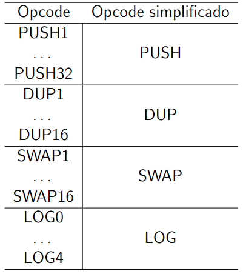

# Desmontador (disassemble) de bytecode para opcode:

 https://raw.githubusercontent.com/marwin1991/profile-technology-icons/refs/heads/main/icons/jupyter_notebook.png https://raw.githubusercontent.com/marwin1991/profile-technology-icons/refs/heads/main/icons/ethereum.png 

## Sobre a ferramenta:
Ferramenta para desmontar bytecodes de contratos inteligentes em seus respectivos opcodes. É uma alternativa a ferramente oferecida pela [Etherscan](https://etherscan.io/opcode-tool), que permite desmontar somente um bytecode por vez.

A ferramenta faz web scraping no site https://ethervm.io e coleta os bytecodes e seus respectivos opcodes, criando um dicionario que permite desmontar grandes quantidade de bytecodes (desde que estejam em um arquivo .csv).

## Versões do desmontador:
O arquivo V1 desmonta os bytecodes de modo generalizado na operação PUSH, SWAP, DUP, LOG. Por exemplo:

O arquivo V2 também desmonta os bytecodes de forma generalizada. No entanto, na operação PUSH, ele mantém o sufixo correspondente ao bytecode e adiciona "NUM" antes do PUSH(sufixo).

## Como usar o desmontador:
Basta organizar o seu dataset com o cabeçalho 'bytecode' e 'category' e inserir ele em 'input_csv'. Ao rodar, será gerado um novo dataset chamado 'output.csv' que terá todos os opcodes respectivos ao seu dataset de origem inserido em 'input.csv'.

TO-DO: Aceitar outros tipos, como JSON.
